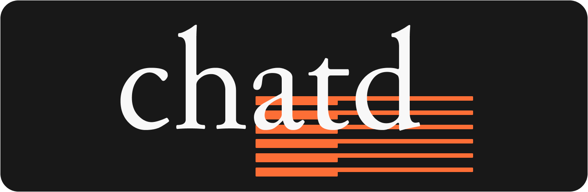
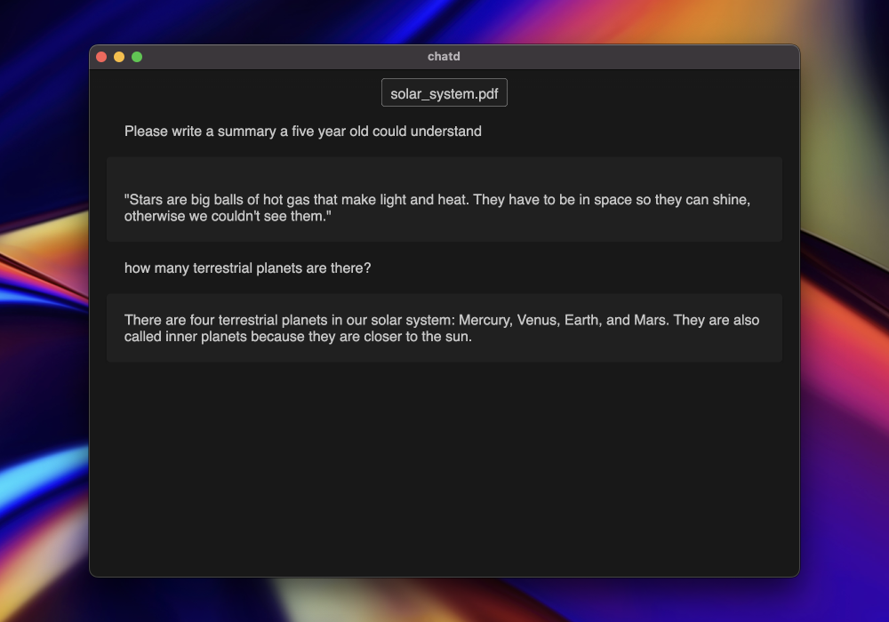
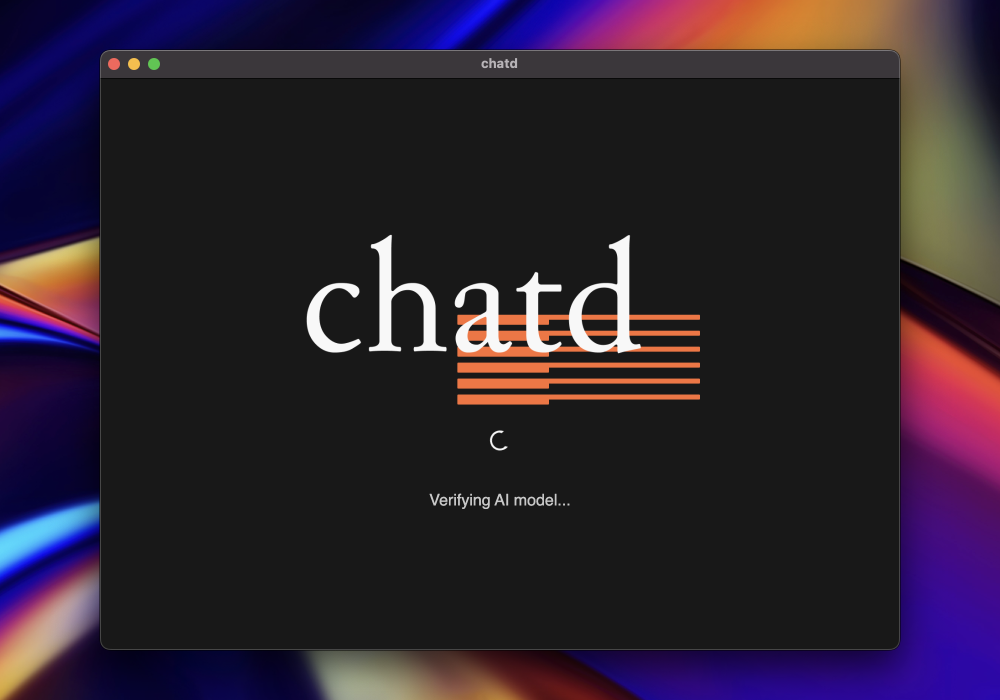
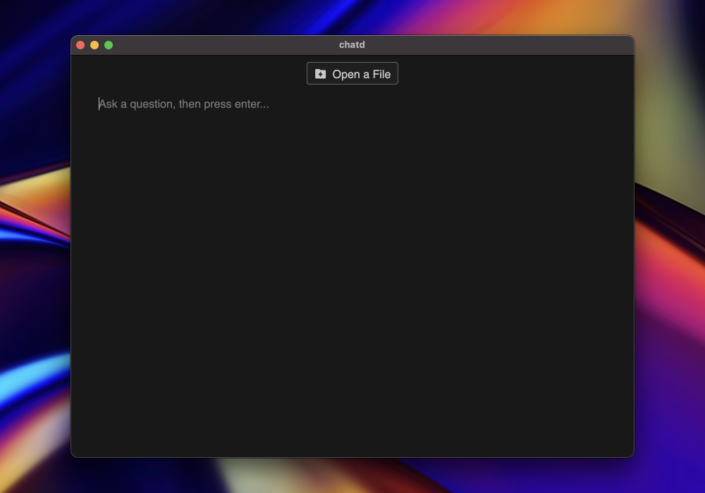

<div align="center">
    
</div>

[See a video demo.](https://github.com/BruceMacD/chatd/assets/5853428/a7d8b77c-beae-41a4-bfd6-0fd5cf932b43)

Chat with your documents using local AI. All your data stays on your computer and is never sent to the cloud. Chatd is a completely private and secure way to interact with your documents.

Chatd is a desktop application that lets you use a local large language model (`Mistral-7B`) to chat with your documents. What makes chatd different from other "chat with local documents" apps is that it comes with the local LLM runner packaged in. This means that you don't need to install anything else to use chatd, just run the executable.

Chatd uses Ollama to run the LLM. Ollama is an LLM server that provides a cross-platform LLM runner API. If you already have an Ollama instance running locally, chatd will automatically use it. Otherwise, chatd will start an Ollama server for you and manage its lifecycle.

<div align="center">
    </img>
    </img>
    </img>
</div>

## Quickstart

1. Download the latest release from [chatd.ai](https://chatd.ai) or the [releases page](https://github.com/BruceMacD/chatd/releases).
2. Unzip the downloaded file.
3. Run the `chatd` executable.

## Advanced Setup

- [Enable GPU support.](docs/enable_gpu_support.md)
- [Select a custom model.](docs/select_a_custom_model.md)

## Links

- [chatd.ai](https://chatd.ai)
- [ollama.ai](https://ollama.ai)

## Development

Run the following commands in the root directory.

```bash
npm install
npm run start
```

## Packaging and Distribution

### MacOS

1. Download the latest `ollama-darwin` release for MacOS from [here](https://github.com/jmorganca/ollama/releases).
2. Make the downloaded binary executable: `chmod +x path/to/ollama-darwin`
3. Copy the `ollama-darwin` executable to the `chatd/src/service/ollama/runners` directory.
4. Optional: The Electron app needs be signed to be able to run on MacOS systems other than the one it was compiled on, so you need a developer certificate. To sign the app, set the following environment variables:

```bash
APPLE_ID=your_apple_id@example.com
APPLE_IDENTITY="Developer ID Application: Your Name (ABCDEF1234)"
APPLE_ID_PASSWORD=your_apple_id_app_specific_password
APPLE_TEAM_ID=ABCDEF1234
```

You can find your Apple ID, Apple Team ID, and Apple ID Application in your Apple Developer account. You can create an app-specific password [here](https://appleid.apple.com/account/manage).

5. Run `npm run package` to package the app.

### Windows

1. Build Ollama from source for Windows, this will support CPU only. See [here](https://github.com/jmorganca/ollama).
2. Copy the `ollama.exe` executable to `chatd/src/service/ollama/runners/ollama.exe`.
3. Run `npm run package` to package the app.

Note: The Windows app is not signed, so you will get a warning when you run it.

### Linux

1. Build Ollama from source for Linux x64 to support CPU only, this allows for a smaller executable package. See [here](https://github.com/jmorganca/ollama).
2. Copy the `ollama` executable to `chatd/src/service/ollama/runners/ollama-linux`.
3. Run `npm run package` to package the app.
