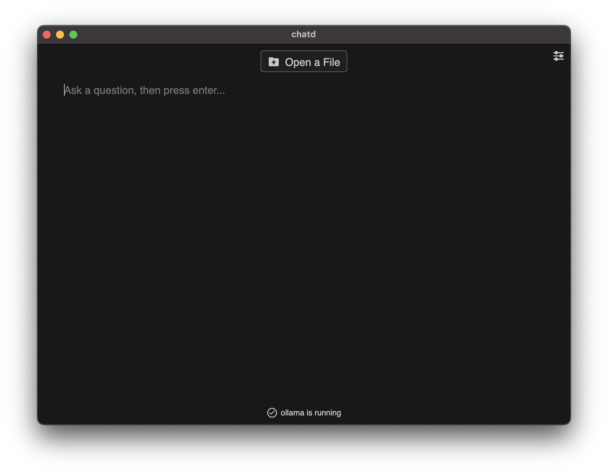

# How do I use my GPU to make chatd faster?

If you have a GPU it is possible for chatd to use it to speed up the chat response time. Currently only NVIDIA GPUs are supported.

## Requirements

- NVIDIA GPU with CUDA support
- Linux (Windows support is planned)

## Enable GPU support

1. Download [Ollama](https://www.ollama.ai/download/linux) for Linux:

```bash
curl https://ollama.ai/install.sh | sh
```

2. After installing Ollama, chatd will automatically use your GPU to speed up chat response time. You can verify that chatd is connected to Ollama by checking for the `ollama is running` message on the home screen.


