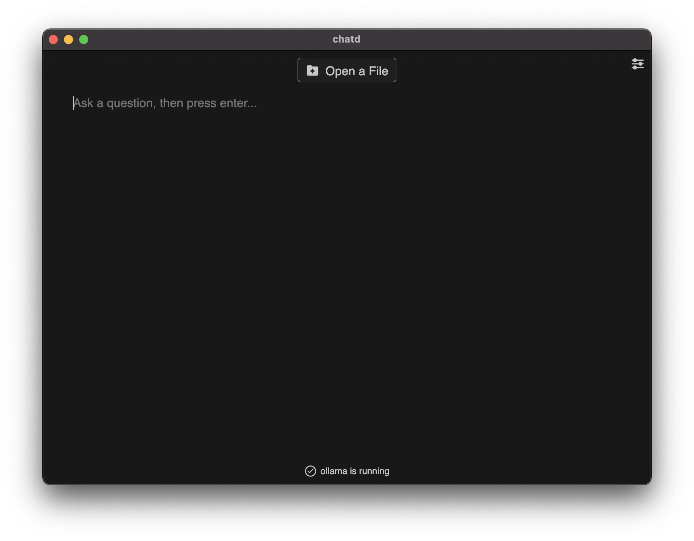
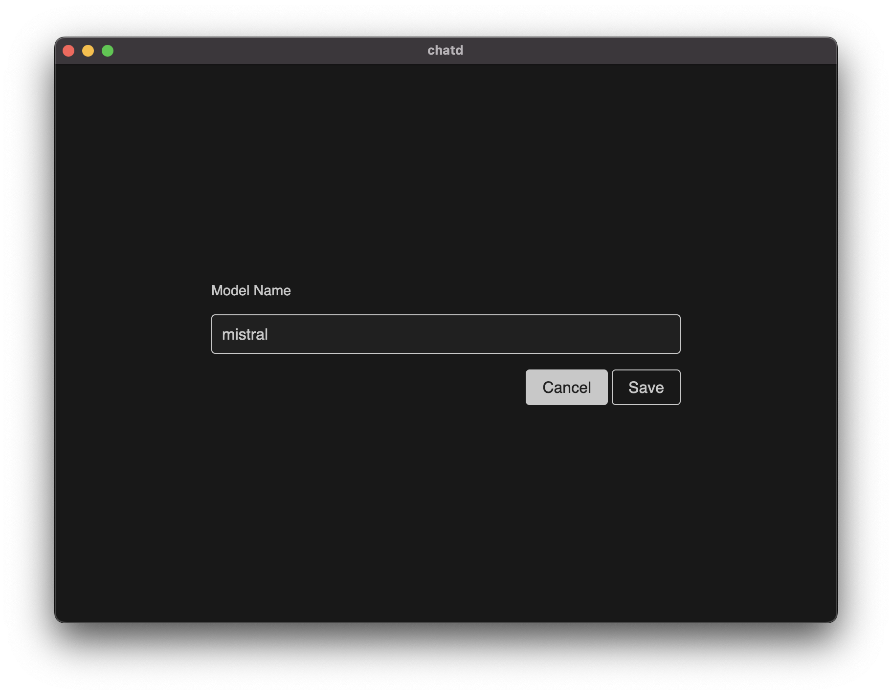

# Select a Custom Model

By default chatd will manages the AI model for you. This means that chatd will download the model, cache it, and keep it up to date. If you want to use a custom model, you can do so by following the steps below.

## Requirements

- [Ollama](https://ollama.ai/download)

## Steps

1. Download [Ollama](https://www.ollama.ai/download) for your platform.
2. Select the model you want to use from the [Ollama library](https://www.ollama.ai/library) page.
3. Open a terminal and run the following command to download the model:

```bash
ollama pull <model_name>
```

4. While Ollama is running, open chatd and click the settings button on the home screen (top right).



5. Type the name of the model you want to use in the `Model Name` field and click `Save`.


